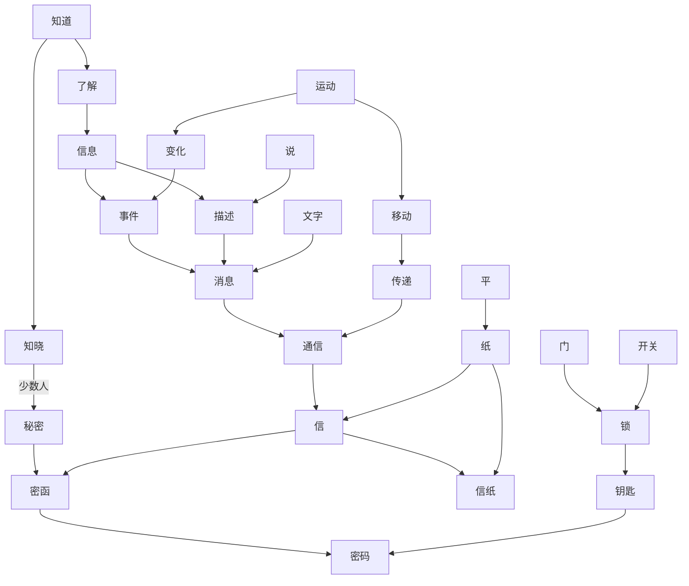
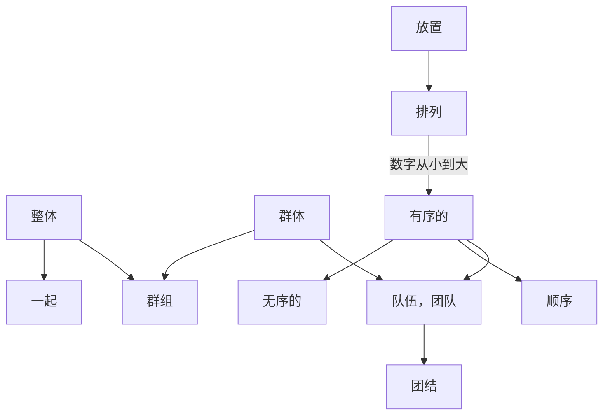

Q: lí ûnsu lu yr? 他是那个人吗？

A: ui, lí no lu yr/vie, lí mo lu yr. 是的，他是那位/不是，他不是那位

Q: lí ûnmo lu yr? 他不是那位吗？

A: ui, lí mo lu yr/vie, lí no lu yr. 是的，他不是那位/不是，他是那位

```mermaid
graph TD
    知道 --> C[知晓]
    知道 --> 了解 --> 信息
    信息 --> 事件
    信息 --> 描述
    运动 --> 变化 --> 事件 --> B
    说 --> 描述 --> B
    A[文字] --> B[消息] --> G
    
    C --> |少数人|D[秘密] --> I
    
    运动 --> E[移动] --> F[传递] --> G[通信] --> H[信] --> I[密函] --> O
    
    平 --> J[纸] --> H
    H --> K[信纸]
    J --> K
    
    L[门] --> M[锁] --> N[钥匙] --> O[密码]
    开关 --> M
```

```mermaid
graph TD
	整体 --> 一起
	整体 --> 群组
	群体 --> 群组
	放置 --> 排列 -- 数字从小到大 --> 有序的 --> 无序的
	有序的 --> 顺序
	有序的 --> A[队伍，团队]
	群体 --> A --> 团结
```