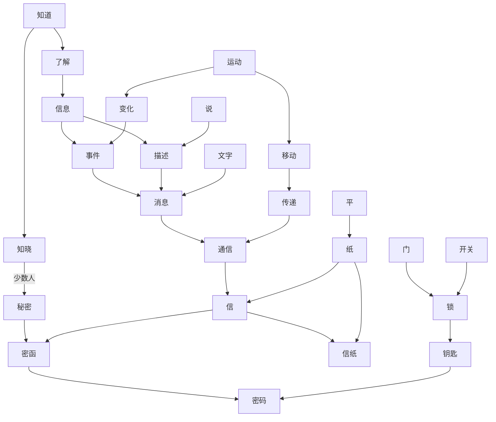

Q: lo su ûnyr?

A: ui, lo no ûnyr.

```mermaid
graph TD
    知道 --> C[知晓]
    知道 --> 了解 --> 信息
    信息 --> 事件
    信息 --> 描述
    运动 --> 变化 --> 事件 --> B
    说 --> 描述 --> B
    A[文字] --> B[消息] --> G
    
    C --> |少数人|D[秘密] --> I
    
    运动 --> E[移动] --> F[传递] --> G[通信] --> H[信] --> I[密函] --> O
    
    平 --> J[纸] --> H
    H --> K[信纸]
    J --> K
    
    L[门] --> M[锁] --> N[钥匙] --> O[密码]
    开关 --> M
```